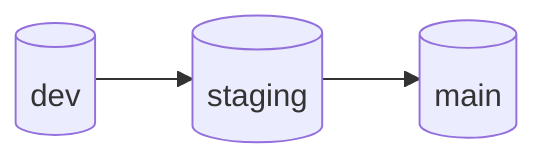

# Git flow

How branches map to environments and how to promote code. This matches **`docs/DEPLOYMENT.md`** (each server checks out one long-lived branch).

---

## Branches and environments

| Branch     | Role                         | Typical deploy folder                    |
|-----------|------------------------------|------------------------------------------|
| **`dev`** | Integration / daily work     | `/var/www/nextpress-backend-dev`         |
| **`staging`** | Pre-production smoke tests | `/var/www/nextpress-backend-staging`     |
| **`main`** | Production                  | `/var/www/nextpress-backend-production`  |

Flow direction (promotion):

```text
dev  ──merge──►  staging  ──merge──►  main
```

---

## Daily work (on `dev`)

1. **Start from latest `dev`:**
   ```bash
   git fetch origin
   git checkout dev
   git pull origin dev
   ```

2. **Option A — commit directly on `dev`** (small team / solo):
   ```bash
   # edit, then:
   git add -A && git commit -m "feat: …"
   git push origin dev
   ```

3. **Option B — short-lived feature branch** (optional):
   ```bash
   git checkout -b feature/short-name
   # commit work
   git push -u origin feature/short-name
   ```
   Open a **Pull Request: `feature/…` → `dev`** on GitHub, review, merge.

4. **Deploy dev server** (if you use one): run `./scripts/deploy dev` from the dev folder — see [deployment/dev.md](deployment/dev.md).

---

## Promote to staging

When `dev` is stable enough for pre-prod:

```bash
git checkout staging
git pull origin staging
git merge dev
# resolve conflicts if any, test locally if needed
git push origin staging
```

Then deploy staging: `./scripts/deploy staging` in the staging folder — [deployment/staging.md](deployment/staging.md).

---

## Promote to production (`main`)

When staging is validated:

```bash
git checkout main
git pull origin main
git merge staging
git push origin main
```

Then deploy production: `./scripts/deploy` (or `./scripts/deploy production`) — [deployment/production.md](deployment/production.md).

---

## Sync long-lived branches backward (optional)

After a production release, keep `staging` and `dev` aligned with `main` so hotfixes do not diverge:

```bash
git checkout main && git pull origin main
git checkout staging && git merge main && git push origin staging
git checkout dev && git merge main && git push origin dev
```

Use this when you fixed something on `main` only, or after tagging a release.

---

## Hotfix on production (minimal path)

1. Branch from `main`, fix, PR/merge to `main`, deploy production.
2. Merge `main` back into `staging` and `dev` (same commands as in **Sync backward** above).

---

## Rules of thumb

- **Never force-push** `main` or `staging` unless you know exactly why.
- **Migrations:** apply on each environment after deploy (`scripts/deploy` runs migrate up); test migrations on `dev` / `staging` before promoting.
- **Secrets:** never commit `.env`; use `.env.example` only for keys and comments.

---

## Diagram



*(Merge + push at each arrow. If Mermaid is not rendered, use the ASCII diagram in [Branches and environments](#branches-and-environments).)*
